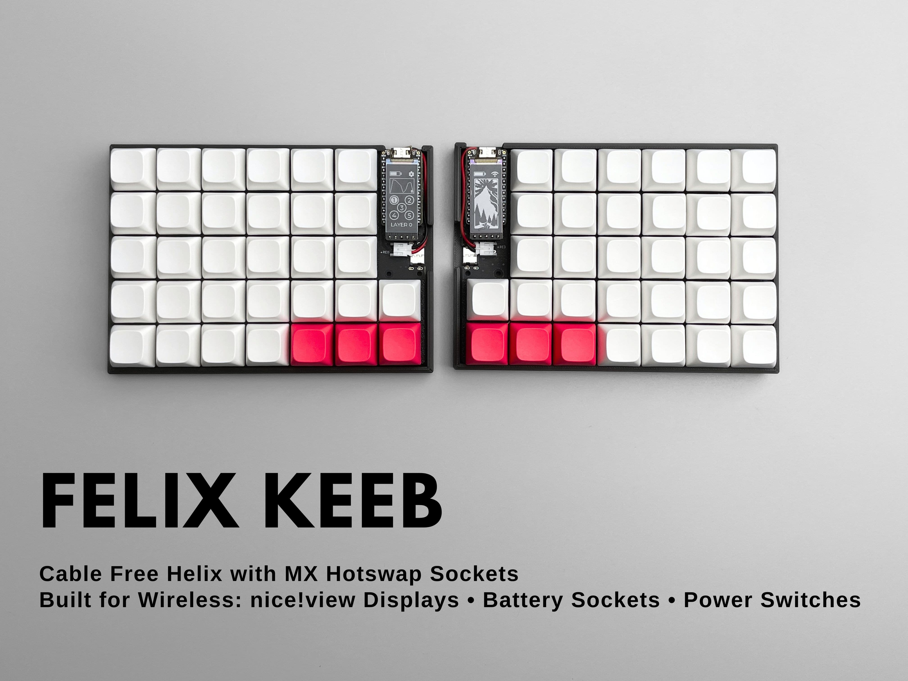

# FelixKeeb

The FelixKeeb is an open source 5×12+4 (5×6+2 on each side) split ortholinear keyboard with hotswap sockets support released by [beekeeb](https://beekeeb.shop). It is based on Cipulot’s [helixhschoc](https://github.com/cipulot/helixhschoc) and MakotoKurauchi’s [helix](https://github.com/MakotoKurauchi/helix).

## Quick Links

* [Precompiled firmware](https://docs.beekeeb.com/felixkeeb#precompiled-firmware)
* [beekeeb showcase](https://showcase.beekeeb.com/felixkeeb/)

## Firmware

* [QMK](https://github.com/qmk/qmk_firmware) - compatible with helix/rev2
* [Vial](https://github.com/vial-kb/vial-qmk) (based on QMK) - supported
* [ZMK](https://github.com/zmkfirmware/zmk) - supported

Precompiled firmware can be found at https://docs.beekeeb.com/felixkeeb.

## Features

* Hotswap Sockets: Changing key switches whenever you want

### Wireless

* nice!view support
* Onboard JST battery sockets: no battery soldering required & easily swapping batteries
* Power (on/off) switches: saving power by turning off the keyboard when it is not in used

### Wired

* OLED display support
* USB-C connectors: No pin shorting problems caused by TRRS jacks
* Compatible with Helix/rev2 VIAL Firmware

## License

Photos, logos, external symbols and footprints are not covered by the LICENSE in this repo.

External symbols and footprints:

* [foostan/kbd](http://github.com/foostan/kbd)
* [nice_view.pretty](https://github.com/petejohanson/crkbd/tree/board/corne-ultralight/corne-ultralight/pcb/nice_view.pretty) from petejohanson's [Corne Ultralight](https://github.com/petejohanson/crkbd/tree/board/corne-ultralight)

## Credits

This open source hardware project is created by [beekeeb](https://beekeeb.shop) and other contributors. It is based on Cipulot’s [helixhschoc](https://github.com/cipulot/helixhschoc) and MakotoKurauchi’s [helix](https://github.com/MakotoKurauchi/helix).

